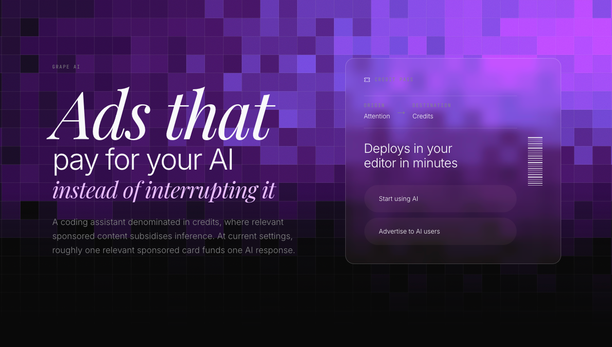
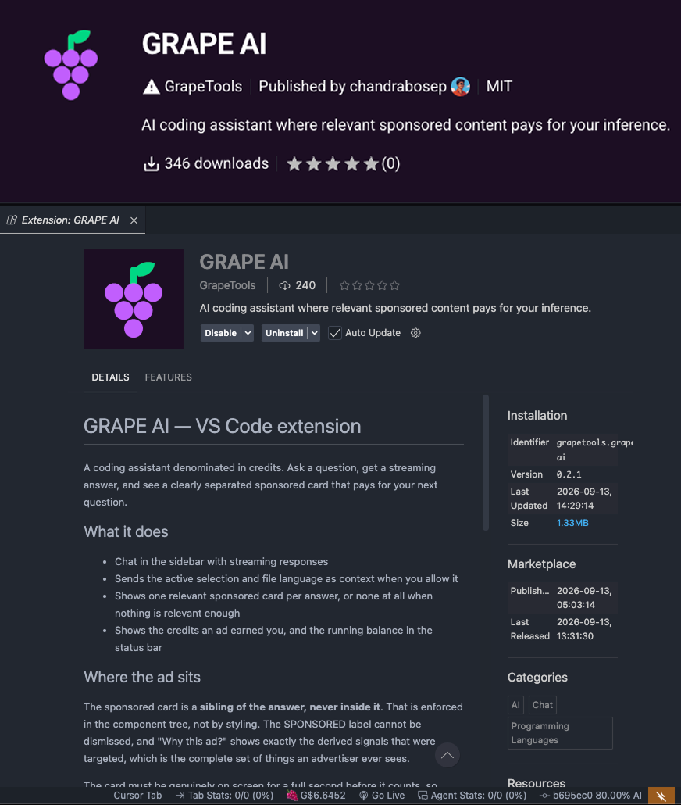
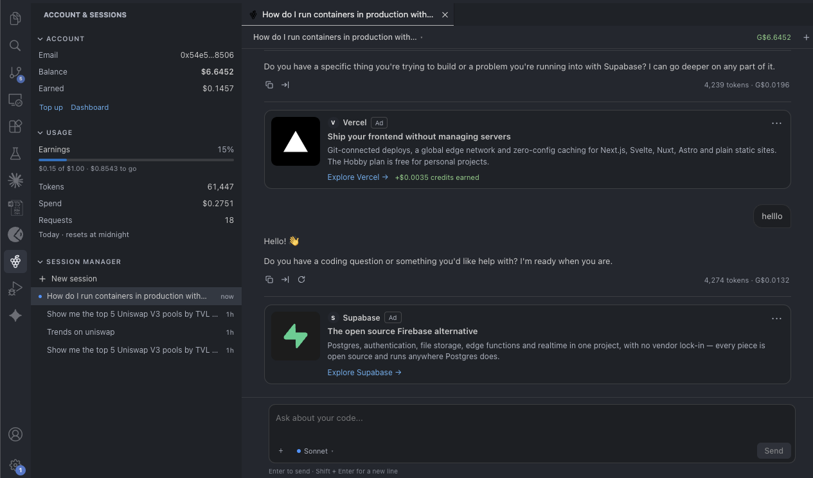

<!-- HERO IMAGE: docs/assets/hero.png -->


<h1 align="center">GRAPE AI</h1>

<p align="center"><strong>Ads that pay for your AI.</strong></p>

<p align="center">
  <a href="https://marketplace.visualstudio.com/items?itemName=GrapeTools.grape-ai">VS Code Marketplace</a> ·
  <a href="https://open-vsx.org/extension/GrapeTools/grape-ai">Open VSX</a> ·
  <a href="https://grape-ai-dev.vercel.app">Web app</a> ·
  <a href="https://grape-ai-api.vercel.app/.well-known/x402">Agent API</a> ·
  <a href="https://hashscan.io/testnet/contract/0.0.10502346">Contracts</a>
</p>

---

Developers spend billions on AI. Brands spend billions trying to reach those same
developers. The two economies never touch.

GRAPE AI is a coding assistant in VS Code that runs on credits instead of a subscription.
You ask a question, you get a streaming answer, and one relevant sponsored card sits beside
it. The brand pays for that attention, most of what they pay lands in your balance as
credits, and those credits buy your next answer. Build more, earn more, pay less. At current
settings roughly one card funds one response.

## The reason advertisers cannot reach developers any more

Developers stopped browsing. The Stack Overflow tab, the docs site, the dev blog, the
newsletter, all of it collapsed into one chat window. A developer now spends the working day
inside their editor asking an AI, which means the entire display advertising industry is
buying impressions on pages their audience no longer opens.

That is the gap. GRAPE AI puts the brand where the developer actually is, at the exact
moment they are choosing a tool. A developer asking how to deploy a Solidity contract is
worth more to an infrastructure company than any demographic segment, and that value exists
only in the second they ask it.

The extension is live and shipping today, with **over 350 organic downloads in its first 24
hours**, so this is real inventory, not a slide.

<!-- IMAGE: marketplace listing / download stats -> docs/assets/extension-live.png -->


## The loop

```
  BUY ──> SPEND ──> SHOW ──> PAY ──> LOOP
   │        │         │       │        │
   │        │         │       │        └─ earnings are credits, which buy more inference
   │        │         │       └────────── confirmed attention pays the developer their share
   │        │         └────────────────── one relevant card appears beside the answer
   │        └──────────────────────────── credits pay for inference, priced per token
   └───────────────────────────────────── credits bought, or granted on signup
```

**Developers** get a starter grant on signup, so the first question is free. After that
credits are spent per token and earned back from attention. The share starts at 70% and
climbs to 85% across three tiers, taken out of the platform's cut rather than off the
advertiser's bill, so a campaign costs the same whoever sees it.

| Tier | Rewards earned | Share | Daily cap |
|---|---|---|---|
| Bud | 0 | 70% | 1x |
| Vine | 25 | 78% | 1.5x |
| Reserve | 100 | 85% | 2x |

**Advertisers** connect a wallet, target a persona built from live onchain history, write
the banner and inline cards, and fund the campaign in USDC on chain. Spend, qualified
impressions, clicks and ROI come back in real time. They are billed only for attention that
cleared the evidence rules, and a user can never be paid more than the advertiser was
charged.

**Agents** pay per call in HBAR over x402. No signup, no balance, no API key.

The card is a sibling of the answer, never inside it. The model is never asked to mention a
sponsor, the auction returns nothing when nothing clears the relevance floor, and advertisers
receive no prompts, code, wallet addresses or identities. "Why this ad?" shows the developer
every signal that was matched.

<!-- IMAGE: extension chat with a sponsored card -> docs/assets/chat-with-ad.png -->


## The Graph

Two jobs, and the product does not work without either.

**It decides who the developer is.** The moment a wallet is linked, GRAPE AI pulls the full
onchain profile and turns it into a persona: active trader, DeFi power user, NFT holder,
smart contract developer. Advertisers target that directly, plus role, region and an activity
window. Three modes: `off` ignores onchain, `boost` scores matched users higher, `require`
makes every criterion mandatory. Flipping that switch visibly changes which ad wins.

**It answers the developer's question.** Ask for the top 5 Uniswap V3 pools by TVL and the
assistant writes the GraphQL itself, reads the result, and builds the chart from live
numbers. Nine protocols across Ethereum, Arbitrum and Base, plus ENS and live token prices.

Three products composed: **Subgraphs** for protocol interaction, the **Token API** for
holdings and recent movement, **Substreams** for block-level transfers that a balance
snapshot misses. All live data, nothing mocked.

The leverage comes from standardization. 13 deployments, 9 protocols, 3 chains, and adding a
protocol to targeting is **one config entry, not new code**, because the Messari standardized
schemas mean one query shape spans a whole schema generation. The lending query runs
unchanged against Aave V2, Aave V3 on two chains, and Compound V3.

## Hedera

Every payment settles here. Two assets, each doing a job the other cannot.

| Asset | Used for | Why |
|---|---|---|
| **HBAR** | Agent payments, per call | Native transfer, no contract, no approval, no allowance, and a fee that does not move with congestion |
| **HTS USDC** | Budgets, settlement, withdrawals | 6 decimals, matching the ledger's micro-USD exactly, so no conversion step exists anywhere |

### HBAR is the machine payment rail

An autonomous agent has no account here and no key, so the ad-funded path is closed to it.
It pays for each call instead, in HBAR, at the moment it calls, and the HTTP response is the
receipt. A live x402-gated inference service, settled through the
[Blocky402](https://blocky402.com) facilitator on Hedera testnet.

The agent hits the endpoint, gets a `402` with payment terms, signs a Hedera
`TransferTransaction`, and retries with the signature. The service verifies, runs the
inference, and settles.

| Route | Tinybars | HBAR | Output ceiling |
|---|---:|---:|---:|
| `POST /v1/inference` | `1000000` | 0.01 | 512 tokens |
| `POST /v1/inference/large` | `5000000` | 0.05 | 4096 tokens |

**Why HBAR and not a token.** At 0.01 HBAR a call, moving the money has to cost almost
nothing and has to cost a *predictable* amount. A native `CRYPTOTRANSFER` has no approval
step, no allowance to manage and no token contract in the path, so payment is one
transaction and one signature. The fee is fixed in USD rather than gas-priced, which means a
congestion spike can never cost more than the item being sold. That is the difference
between per-call pricing as a business model and per-call pricing as a bet. Finality lands in
about three seconds, so the agent waits once, briefly, and gets its answer in the same
request rather than polling.

**Metered, not flat.** The output ceiling is what is actually being sold, so it is what the
price scales with. A flat per-request fee would charge the same for a 50-token answer and a
4,000-token one, which is the thing metered billing exists to avoid. The ceiling is clamped
server-side, so a client cannot ask for 4,000 tokens on the small route and be served them at
the small price, and the large tier is derived as `base * 5n` from one configured value so
the two prices cannot drift apart.

**Integer tinybars on the wire.** 1 HBAR is 100,000,000 tinybars, and the 402 quotes an
integer string, never a decimal, so no float ever touches a price. The agent enforces its own
`X402_AGENT_MAX_TINYBARS` cap before it signs, whatever the 402 quotes, and discovery at
`/.well-known/x402` is free so it reads the terms before committing.

**The agent pays zero gas.** The facilitator signs as fee payer, announced as
`extra.feePayer` in the 402. From a real run:

| Account | Δ tinybars | Role |
|---|---:|---|
| `0.0.10498983` | −1,000,000 | agent, the payer |
| `0.0.10498528` | +1,000,000 | service, `payTo` |
| `0.0.7162784` | −268,834 | Blocky402, the fee payer |
| `0.0.802` | +268,834 | network fee |

0.01 HBAR moved and the agent's balance fell by exactly the quoted price and nothing else.

### USDC for money that sits still

Advertiser budgets lock into `CampaignVault`, settle 70 / 20 / 10, and developer withdrawals
come out of `RewardPool` against a payout id the contract will honour exactly once. The
operator key picks amounts but never destinations, and a fuzz test asserts no value ever
reaches an arbitrary address.

Impressions and individual rewards never touch a contract. A reward worth a few thousandths
of a cent would cost more in gas than it is worth, and would publish exactly the behavioural
trail this product refuses to expose.

## On-chain proof

Read back off the Hedera mirror node, not our database.

| # | What it proves | Link |
|---|---|---|
| 1 | An agent paid for inference with no account and no key | [0.01 HBAR, agent to service](https://hashscan.io/testnet/transaction/0.0.7162784@1789210503.635358513) |
| 2 | An advertiser's 100 USDC split 70 / 20 / 10 | [settle](https://hashscan.io/testnet/transaction/0.0.7314364@1789221257.884494799) |
| 3 | A developer withdrew real USDC | [25 USDC out of the pool](https://hashscan.io/testnet/transaction/0.0.7314364@1789221291.733974890) |
| 4 | The same withdrawal, replayed, refused by the contract | [CONTRACT_REVERT_EXECUTED](https://hashscan.io/testnet/transaction/0.0.7314364@1789221301.463657733) |

| Contract | Hedera id | EVM address |
|---|---|---|
| CampaignVault | [`0.0.10502346`](https://hashscan.io/testnet/contract/0.0.10502346) | `0x4F160b39EbB23DBA8650f50aD5fc95964e085c42` |
| RewardPool | [`0.0.10502343`](https://hashscan.io/testnet/contract/0.0.10502343) | `0x1E0724300F61bbF03caFB9D0fE52A039108B784B` |
| HTS USDC | [`0.0.5449`](https://hashscan.io/testnet/token/0.0.5449) | `0x0000000000000000000000000000000000001549` |

Full decode and a mirror node command to verify any of it yourself:
[`docs/evidence/onchain.md`](docs/evidence/onchain.md) ·
[`docs/evidence/x402-run.md`](docs/evidence/x402-run.md)

## Links

| | |
|---|---|
| VS Code extension | [GrapeTools.grape-ai](https://marketplace.visualstudio.com/items?itemName=GrapeTools.grape-ai) |
| Cursor / Windsurf | [Open VSX](https://open-vsx.org/extension/GrapeTools/grape-ai) |
| Web app | [grape-ai-dev.vercel.app](https://grape-ai-dev.vercel.app) |
| Agent API | [/.well-known/x402](https://grape-ai-api.vercel.app/.well-known/x402) |
| Agent docs | [/agents](https://grape-ai-dev.vercel.app/agents) |
| Economics model | [`docs/economics.md`](docs/economics.md) |
| Submission writeup | [`docs/SUBMISSION.md`](docs/SUBMISSION.md) |
| Contracts | [`contracts/README.md`](contracts/README.md) |

Built for [ETHOnline 2026](https://ethglobal.com/events/ethonline2026). MIT licensed.
