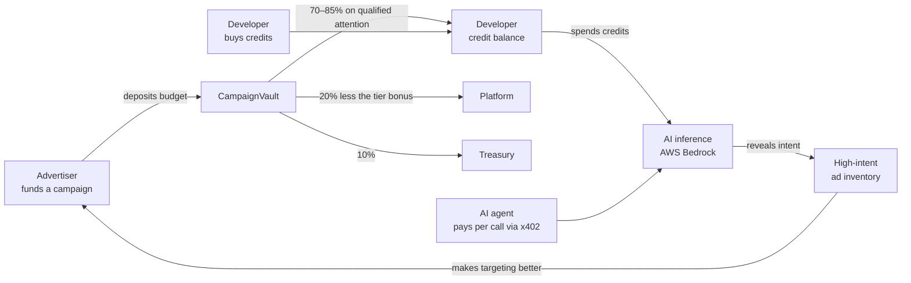

# The credit economy

> Ads don't interrupt the AI. They pay for it.

This document is the canonical description of how money moves through the product.
Every number quoted here comes from
[`apps/web/src/server/config/economics.json`](../apps/web/src/server/config/economics.json)
and is configurable; none of it is hardcoded in business logic.

## The loop

The product is a Cursor-style AI coding assistant whose usage is denominated in
**credits**. There is exactly one currency and exactly one thing to spend it on.

The loop closes because **AI usage is what creates the inventory**. A developer asking
how to deploy a Solidity contract is worth far more to an Ethereum infrastructure
advertiser than any demographic segment, and that value only exists at the moment they
ask. More usage produces better intent, better intent attracts better-paying campaigns,
and those campaigns fund more usage.

## Credits

**One unit, three ways in, two ways out.**

Credits enter a balance by:

1. **Purchase.** The developer buys credits directly, like topping up any usage-based
   developer tool.
2. **Ad rewards.** Qualified attention on a sponsored card pays the developer their share
   of what the advertiser was charged.
3. **Starter grant.** A one-time promotional grant on signup, so a new user can try the
   product and reach their first ad reward without paying first. See *Cold start* below.

Credits leave a balance by:

1. **Inference.** Every request is priced from the provider's own reported token counts.
2. **Payout.** A developer may withdraw earned rewards to their wallet instead of
   spending them, subject to a minimum.

Everything is recorded in an append-only ledger. A balance is the tail of that ledger,
never an independently mutated number, and the database refuses updates and deletes on it.

## What a developer actually earns

Being honest about the magnitude matters more than making it sound exciting. Nobody is
going to make a living watching ads here, and the pitch does not depend on it.

With the current configuration, using the standard model:

| Item | Amount |
|---|---|
| Typical coding request (~1,500 in, ~600 out tokens) | $0.009 |
| Advertiser bid per qualified impression | $0.010 |
| Developer's share at Bud, the opening tier (70%) | $0.007 |
| Developer's share at Reserve, the top tier (85%) | $0.0085 |
| Ads needed to fund one AI response | ~1.3 |

That is the whole claim, and it is a strong one: **roughly one relevant sponsored card
pays for one AI response.** The product is not "earn money watching ads", it is "your AI
is free or nearly free because your attention is genuinely valuable to someone".

A click is worth more than an impression to the advertiser, so it is worth more to the
developer too, currently three times an impression.

## Cold start

A pure buy-credits model has a chicken-and-egg problem worth stating plainly: ads are
shown while using AI, using AI costs credits, and earning credits requires seeing ads. A
brand-new user with a zero balance can do nothing.

The resolution is a **starter credit grant** on signup, large enough for a meaningful
number of requests. From there the loop sustains itself: the user's attention earns
credits at roughly the rate their usage consumes them, and they buy credits only when
they want to go faster than ads can fund.

This also replaces the earlier tiered-plan design. Daily token allowances are not needed
when credits are the single currency; a "plan" now only gates which models are reachable
and how ads behave, and can be reduced to a per-user flag for the hackathon.

## Where the money splits

An advertiser's deposited budget is allocated on each qualified event:

| Share | Default | Purpose |
|---|---|---|
| Developer reward | 70% | the point of the product |
| Platform | 20% | inference cost and operations |
| Treasury / ecosystem | 10% | settlement, growth |

These ratios are configuration, not architecture. A campaign **snapshots** the split when
it activates, so changing the configuration never rewrites the economics of a campaign
that is already running. The split is computed with integer arithmetic that always sums
back to the exact amount charged, so no rounding unit is ever created or lost.

## Earning tiers

The developer's share is a floor, not a fixed number. It rises with the attention they
have actually been paid for, across three rungs:

| Tier | Reached at | Share of each charge | Daily ceiling |
|---|---|---|---|
| **Bud** | signup | 70% | ×1 |
| **Vine** | 25 rewarded ads | 78% | ×1.5 |
| **Reserve** | 100 rewarded ads | 85% | ×2 |

Three properties make this safe to run on every impression:

1. **The advertiser never pays more.** The bonus is carved out of the *platform's* share,
   never added to the charge and never taken from the treasury — the treasury is what
   settles rewards on chain, so borrowing from it to fund a reward would be circular. A
   campaign is charged exactly what it bid whoever happens to see it.
2. **Progress is counted in granted rewards, not in impressions served or prompts sent.**
   Every abuse gate below has already run by the time a reward is granted, so the only
   way to climb is the way the product is meant to be used.
3. **The ceiling moves with the share.** Without that the ladder would be decorative for
   exactly the people who climbed it: a heavy user reaches the same daily cap either way,
   so a larger share of each charge would buy them nothing on the days it mattered.

A rung once reached is never lost. Standing is derived from the rewards table rather than
stored in a counter column, so there is only ever one answer to how much a developer has
earned from attention, and a reversed reward cannot buy progress.

A campaign that snapshotted a *more* generous split than the ladder keeps it: the tier is
a floor on what a developer earns, never a ceiling.

## Why this cannot be farmed

Paying users for attention invites abuse, so rewards are gated on evidence rather than on
an ad being selected. All of these are enforced server-side and none of them trust the
client:

- An impression pays only after the client confirms the card was actually on screen.
- Repeating the same prompt inside the duplicate window earns nothing.
- Rewards are spaced by a minimum interval, so rapid-fire prompting does not compound.
- Each campaign has per-user hourly and daily frequency caps.
- A daily reward ceiling applies per user, higher for verified humans.
- A click on an impression that was never confirmed visible is ignored entirely.
- An account whose abuse score crosses the threshold keeps seeing ads but stops earning.

The economics are also self-limiting: a user can never be paid more than an advertiser was
charged, and a campaign can never be charged beyond its deposited budget.

## Agents pay too

The same inference the extension consumes is exposed as a machine-payable endpoint. An
autonomous agent with no account and no subscription pays per call in HBAR over x402 on
Hedera, settled through the Blocky402 facilitator. This is a second, independent revenue
path into the same gateway, and it is why the product has three actors rather than two:
developers, advertisers, and agents.

## What is deliberately not onchain

High-volume events stay in Postgres: every AI request, every impression, every reward.
Putting them onchain would add cost and latency for no benefit and would leak exactly the
behavioural data the product promises not to expose.

The chain carries what it is actually good for: campaign funding, the allocation split at
settlement, reward payouts, and the agent's per-call payment. Rewards accrue offchain and
settle in batches.
