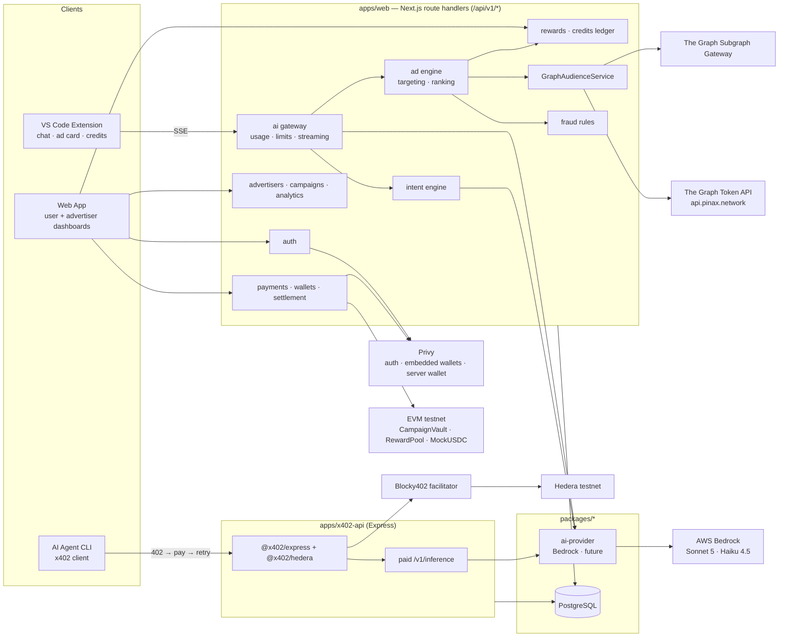
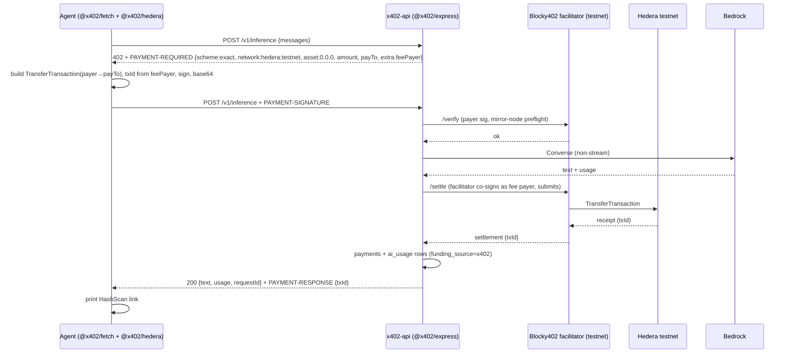

# AI Attention Marketplace — Implementation Plan (ETHOnline 2026)

**Status:** architecture approved; foundation built. See the README for what is implemented.
**Date:** 2026-09-09
**Tagline:** "Ads that pay for your AI."

## Product model (confirmed with the team, 2026-09-09)

A Cursor-style AI coding assistant in VS Code, denominated in **credits**.

1. A developer buys credits, or receives a starter grant on signup.
2. Credits pay for AI inference, priced per token.
3. Between responses, a relevant sponsored card appears, clearly separated from the answer.
4. The advertiser funds a campaign; qualified attention pays the developer their share.
5. Those earnings are credits, which buy more inference.

The loop closes because usage is what creates the inventory: a developer asking how to
deploy a Solidity contract is worth more to an Ethereum infrastructure advertiser than any
demographic segment, and that value exists only at the moment they ask. Roughly one relevant
sponsored card funds one AI response at current settings.

A third actor pays for the same gateway: autonomous agents, per call, over x402 on Hedera.

Full economics, worked numbers and the anti-abuse rationale: **[docs/economics.md](economics.md)**.

---

This plan follows the master prompt in the repo root and is grounded in research against the *current* official docs of every integration (Sept 9, 2026). Section 0 lists the findings that changed the design. Everything after that is the plan itself.

---

## 0. Research findings that change the design (read first)

| Area | Verified finding (2026-09-09) | Consequence for this plan |
|---|---|---|
| **Deadline** | ETHOnline runs Sept 4–16; a search snippet says submissions close **Sun Sept 13, 12:00 EDT**. Not confirmed on ethglobal.com. | **Verify today.** If true there are ~4 build days. The roadmap in §23 is written as a 4-day critical path with a 2-day extension buffer. |
| **The Graph data sources** | `token-api.thegraph.com` is dead; the Token API now lives at **`https://api.pinax.network`** (Pinax, "powered by The Graph"), mainnets only, no Sepolia. Subgraphs are queried through the gateway with a Subgraph Studio key (100k free queries/month). **Messari Standardized Subgraphs** give one schema per protocol type (lending, DEX) across many protocols. No Graph product has wallet history on testnets. | Onchain audience signals are computed from **real mainnet wallets**: users link an existing wallet (Privy `linkWallet`) or seeded demo users carry known active mainnet addresses. Embedded wallets are brand new and are not the signal source. |
| **The Graph prizes** (full text supplied by you) | "Composable/Standardized" rewards **one query pattern spanning many protocols** and names Messari Standardized Subgraphs, composable Substreams, and the Subgraph MCP. It never mentions the Token API. "AI Use Case (From Scratch)" needs The Graph load-bearing, live data, and "reasoning, decisions, automation" with a README or SKILL.md. Both need a public repo and a 2–4 min video. | `GraphAudienceService` is built **on the Messari standardized lending and DEX schemas** (same query across Aave, Compound, Spark, Uniswap, Sushi, Curve…) and composes the **Token API** as a second Graph product for holdings/NFT signals. The Subgraph MCP powers an optional natural-language audience builder. Signals drive automated ad decisions, which is the "meaningful work" the AI track asks for. |
| **x402 on Hedera** | Hedera's `exact` scheme is upstream in **x402-foundation/x402**. Use **`@x402/core`, `@x402/express`, `@x402/fetch`, `@x402/hedera`** (v2.25.0). Legacy `x402-express` v1 has no Hedera support and Blocky402 rejects v1 envelopes. Network id is **`hedera:testnet`** (not eip155:296). Payment is a signed Hiero `TransferTransaction`, not EIP-3009; the facilitator is fee payer. HBAR = asset `0.0.0`; testnet USDC = `0.0.429274` (needs token association on payer *and* payee). **Blocky402 testnet facilitator** `https://api.testnet.blocky402.com` is live and is a **prize requirement**. Official reference: `hedera-dev/x402-inference-pay-per-request-poc`. | The x402 API is a small **Express** service (the official middleware is Express/Hono), separate from the Next.js app, sharing the AI provider and Prisma packages. Price in **HBAR** by default (no association step), USDC as a second route. Agent demo uses `@x402/fetch`. |
| **Privy** | `@privy-io/server-auth` is **deprecated**; use **`@privy-io/node`** (0.34). React SDK is **`@privy-io/react-auth` 3.40**; `createOnLogin` now lives under `embeddedWallets.ethereum`. `viem/chains` ships `hederaTestnet` (id 296) but Privy docs never mention Hedera; Base Sepolia / Sepolia are supported first-class including gas sponsorship. Server wallets with policies exist (relevant to the B2B prize). | **Day-0 spike:** send a tx from a Privy embedded wallet on Hedera testnet. If it works, all EVM contracts go on Hedera testnet (single-chain story). If not, contracts go on **Base Sepolia**. The decision gate is in §23. |
| **AWS Bedrock** | Use the **Converse / ConverseStream** API. Claude Sonnet 5 / Opus 5 / Haiku 4.5 require **`us.`/`global.` inference-profile IDs** (no in-region ID). Usage arrives in the final `metadata` stream event. Per-model access requests are gone; Anthropic needs a one-time use-case form. Forced tool call (`toolChoice: {tool}`) is the portable way to get JSON. | Chat model `us.anthropic.claude-sonnet-5`; intent classifier `us.anthropic.claude-haiku-4-5-20251001-v1:0` with a forced `classify_intent` tool. Token accounting reads the `metadata.usage` event. |
| **VS Code** | Recommended browser→extension handoff is `registerUriHandler` + `env.asExternalUri` + `env.openExternal`, with `state` and a **single-use exchange code** (never the Privy token in the URL). `env.uriScheme` varies (`vscode`, `vscode-insiders`, `cursor`). `SecretStorage` for tokens. Chat UI must be a **WebviewView**; the Chat Participant API cannot render custom cards. Hidden webviews cannot receive messages, so stream chunks must be buffered host-side. Extension host is Node 22 (native `fetch` + streams). | Auth flow in §14 is exactly this. Chat is a sidebar WebviewView with a bundled React app. |
| **Prize fit (from ethglobal.com/events/ethonline2026/prizes)** | Graph: 2 tracks above. Hedera: "AI & Agentic Payments" ($6k, Blocky402, one real paid request, README + ≤5 min video; bonus for per-call metering, HCS audit trail, HTS). Privy: "Best Financial Flow" (≥1 Privy wallet, ≥1 real financial flow) and "Best B2B Financial Product" (org wallets + ≥1 Privy control such as policies). World: only Selfie Check / AgentKit, both requiring a feedback doc. | Primary: Graph AI + Composable, Hedera Agentic Payments, Privy Financial Flow. Secondary: Privy B2B (advertiser treasury wallet with a spend policy). Optional: World Selfie Check as reward-eligibility signal. Nothing else. |

**Stack decision (2026-09-09, per your preference):** Next.js (App Router) hosts both the web app and the `/api/v1/*` backend as route handlers; **Prisma** on **Supabase Postgres**; **shadcn/ui** + Tailwind. Supabase is used as a managed Postgres (plus Storage for ad creative images); **auth stays with Privy**, not Supabase Auth. The x402 service remains a separate small Express app because the official `@x402/express` middleware is Express-only. The module boundaries and schema are unchanged from the first draft.

---

## 1. Overall architecture

Three user-facing surfaces, one Next.js app (UI + `/api/v1` route handlers), one small Express x402 service, one Supabase Postgres via Prisma, two tiny contracts.



**Request lifecycle for one VS Code prompt** (the core loop):

1. Extension POSTs `{messages, context, model}` with bearer token to `POST /v1/ai/chat`.
2. `auth` verifies the session JWT; `usage` checks plan allowance / credits and reserves `maxTokens`.
3. `intent` classifies the last user message: rules-based stage returns instantly; Haiku stage runs concurrently (≤1.5s budget).
4. `ai gateway` opens the Bedrock stream immediately and starts forwarding `delta` events.
5. As soon as intent is ready, `ads` loads eligible campaigns, pulls cached onchain signals (via `GraphAudienceService`), scores, picks the winner, writes `ad_impressions`, and emits an `ad` SSE event mid-stream.
6. Bedrock's final `metadata` event yields exact tokens → `ai_usage` row, allowance/credit debit, `usage` event.
7. Extension acks ad visibility → impression becomes *qualified* → `rewards` + `credit_transactions` rows → `reward` event / poll.
8. Nothing touches a blockchain in this path. Settlement is batched (§13, §16).

**Design principles applied:** server enforces everything; DB is the source of truth for high-volume events; chain is used only for funding, settlement, payouts, and the x402 paid request; advertisers never see per-user data.

---

## 2. Repository / project structure

pnpm workspaces + Turborepo. One `tsconfig.base.json`, ESLint + Prettier, Vitest everywhere.

```
eth-online-26/
├── apps/
│   ├── web/                      # Next.js 15 App Router: UI + backend (port 3000)
│   │   ├── app/
│   │   │   ├── (marketing)/      # landing
│   │   │   ├── (user)/app/…      # user dashboard, wallet, usage, plan, rewards
│   │   │   ├── (advertiser)/advertise/…
│   │   │   ├── auth/vscode/      # extension handoff page
│   │   │   └── api/v1/…/route.ts # thin route handlers → server modules (see §3)
│   │   ├── src/server/           # THE BACKEND (framework-agnostic TypeScript)
│   │   │   ├── modules/          # auth, users, ai, intent, usage, plans, credits, advertisers,
│   │   │   │                     # campaigns, targeting, ads, rewards, graph, payments, wallets, fraud, analytics
│   │   │   ├── lib/              # sse, errors, money, hashing, http (withAuth, withRole, validate)
│   │   │   ├── config/           # zod-validated env + economics.json loader
│   │   │   └── jobs/             # settlement, signal refresh (route handlers hit by Vercel Cron / manual)
│   │   ├── components/           # shadcn/ui + app components
│   │   ├── lib/                  # client helpers (api client, privy, viem)
│   │   └── test/                 # unit + integration
│   ├── x402-api/                 # Express x402-gated inference (port 4402)
│   │   └── src/{server.ts, routes/inference.ts, hcs.ts(optional)}
│   ├── agent-demo/               # CLI agent: discover → 402 → pay → retry → answer
│   └── vscode-extension/
│       ├── src/                  # extension host (esbuild → dist/extension.js)
│       └── webview/              # React chat UI (Vite → dist/webview.js)
├── packages/
│   ├── db/                       # prisma/schema.prisma, migrations, generated client, seed.ts
│   ├── shared/                   # zod schemas + TS types for API contracts, SSE events, taxonomy
│   ├── ai-provider/              # AIProvider interface, BedrockProvider, FakeProvider (tests)
│   ├── economics/                # pure functions: scoring, reward split, cost estimate (no IO)
│   └── config/                   # shared eslint/tsconfig/prettier
├── contracts/                    # Foundry: CampaignVault, RewardPool, MockUSDC + deploy scripts
├── docs/
├── scripts/                      # associate-token.ts, fund-demo-accounts.ts, verify-subgraphs.ts
├── .env.example
├── turbo.json · pnpm-workspace.yaml · package.json
└── README.md
```

Why the backend lives in `apps/web/src/server` and not in `app/api`: route handlers stay 5–10 lines (parse, auth, call service, respond) so the modules can be unit-tested without Next.js and could be lifted into a standalone server later. `packages/db` is shared with `apps/x402-api`, which needs the same Prisma client.

Why `packages/economics` is separate: the scoring, allocation, and reward math must be pure and unit-testable in isolation, and both the API and the web "campaign preview" reuse it.

**Next.js specifics that matter here**
- `POST /api/v1/ai/chat` streams SSE from a Node-runtime route handler (`export const runtime = 'nodejs'`, `dynamic = 'force-dynamic'`), returning a `ReadableStream` with `Content-Type: text/event-stream`. Set `maxDuration` (e.g. 120 s) for the deployed function.
- Route handlers for VS Code must send CORS headers (extension origin is `vscode-webview://` / none), handled by a shared `withCors` wrapper.
- Background jobs are route handlers under `/api/internal/*` protected by an admin token and triggered by Vercel Cron or by hand during the demo.

---

## 3. Main backend modules (`apps/api/src/modules`)

Each module in `apps/web/src/server/modules/<name>/` = `service.ts` (business logic), `repo.ts` (Prisma queries), `schemas.ts` (zod), `types.ts`, `*.test.ts`. The matching `app/api/v1/<name>/…/route.ts` files are thin adapters.

| Module | Responsibility | Depends on |
|---|---|---|
| `auth` | Privy token verification (`@privy-io/node`), own session JWT + refresh tokens, VS Code one-time code exchange, RBAC guards (`user`, `advertiser`, `admin`) | users |
| `users` | user row keyed by Privy DID, profile (persona, interests, technologies, country), linked wallets, World verification flag | wallets |
| `ai` | `POST /api/v1/ai/chat` SSE orchestrator; model registry; calls `packages/ai-provider` | usage, intent, ads, credits |
| `intent` | rules classifier + LLM classifier, taxonomy, prompt hashing, `ai_intents` persistence | ai-provider |
| `usage` | plan lookup, daily allowance, reservation → actual debit, rate limits, `ai_usage` ledger, cost estimate | plans, credits |
| `plans` | plans + subscriptions, upgrade via credits | credits |
| `credits` | **append-only** `credit_transactions` ledger, balance materialization, idempotency keys | — |
| `advertisers` | advertiser org onboarding, org wallet (Privy server wallet, optional B2B) | users, wallets |
| `campaigns` | CRUD, status machine, funding intent/confirm, budget accounting, daily stats | payments |
| `targeting` | campaign_targeting persistence, criteria validation, audience estimate | graph |
| `ads` | eligibility + ranking (`packages/economics/scoring`), impression creation, ack/click, "why this ad" | targeting, graph, fraud, rewards |
| `rewards` | qualified-impression and engagement rewards, caps, allocation split, `rewards` rows, credit grant | credits, fraud, campaigns |
| `graph` | `GraphAudienceService`: Pinax Token API + Subgraph gateway clients, normalizer, cache in `onchain_signals` | — |
| `payments` | `payments` table; funding tx verification (viem receipt + event decode); reward payout via RewardPool/operator; settlement batches | wallets |
| `wallets` | embedded/linked/server wallet records, address ownership proof (SIWE-style signature) | — |
| `fraud` | deterministic rules → per-request fraud score, dedupe, velocity checks | — |
| `analytics` | advertiser dashboards (aggregates only), user usage charts | — |
| `x402` (thin) | shared helpers: pricing table, payment recording used by `apps/x402-api` | payments, usage |

Cross-cutting (`src/server/lib`): `withAuth`/`withRole` wrappers that resolve `user` from the bearer token, `rateLimit` (Postgres- or Upstash-backed sliding window per user and per IP), `sse` (typed event writer over `ReadableStream`), pino logger with prompt redaction, OpenAPI generated from the zod schemas via `zod-openapi` and served at `/api/docs`.

---

## 4. Database schema (Supabase Postgres, Prisma)

Money is stored as `BigInt` **micro-USD** (`1_000_000 = $1.00`). Tokens as `Int`. All models have `id String @id @default(uuid())`, `createdAt DateTime @default(now())`. Enums are Prisma enums (Postgres enums). Prisma specifics: use the Supabase **transaction pooler** URL (port 6543) as `DATABASE_URL` for runtime and the **direct** URL (5432) as `DIRECT_URL` for migrations; use the current Prisma major with the `@prisma/adapter-pg` driver adapter (verify the exact version on Day 0). Appending-only ledger protection is a Postgres trigger added in a raw SQL migration, since Prisma cannot express it.

### Identity & plans
- **users**: `privy_did text unique`, `email text?`, `display_name`, `role text[] default {user}`, `country_code char(2)?`, `world_verified bool default false`, `fraud_score numeric(4,3) default 0`, `last_seen_at`.
- **user_profiles** (1:1): `user_id fk unique`, `persona text?` (taxonomy), `interests text[]`, `technologies text[]`, `ads_opt_out bool`, `include_code_context bool default true`.
- **wallets**: `user_id fk`, `address text`, `chain_type text` (`evm`|`hedera`), `kind` enum (`privy_embedded`|`linked_external`|`server`), `is_primary_signal_source bool`, `verified_at` (signature proof for external). Unique `(address, chain_type)`.
- **plans**: `code` (`FREE`|`EARN`|`PRO`) unique, `name`, `daily_token_allowance int`, `allowed_models text[]`, `ads_enabled bool`, `price_micro bigint`, `max_context_chars int`, `features jsonb`.
- **subscriptions**: `user_id fk`, `plan_id fk`, `status`, `starts_at`, `ends_at?`, `source` (`default`|`credits`|`payment`). Index `(user_id, status)`.
- **api_sessions**: `user_id fk`, `client` (`web`|`vscode`), `refresh_token_hash text unique`, `expires_at`, `revoked_at?`, `user_agent`.
- **vscode_auth_codes**: `code_hash text unique`, `user_id fk`, `state text`, `expires_at`, `used_at?`.

### Advertising
- **organizations**: `name`, `owner_user_id fk`, `treasury_wallet_id fk?` (Privy server wallet, optional).
- **advertisers**: `org_id fk`, `user_id fk`, `name`, `website`, `status` (`active`|`suspended`).
- **campaigns**: `advertiser_id fk`, `name`, `status` enum (`draft`|`awaiting_funding`|`active`|`paused`|`exhausted`|`ended`), `budget_micro`, `spent_micro default 0`, `bid_micro` (price per qualified impression), `click_multiplier numeric default 3`, `allocation jsonb` (snapshot `{reward:0.7, platform:0.2, treasury:0.1}` taken from config at activation), `daily_spend_cap_micro?`, `frequency_cap jsonb` (`{perUserPerHour:1, perUserPerDay:3}`), `starts_at`, `ends_at`, `vault_key bytea(32)` (bytes32 used onchain), `funding_payment_id fk?`. Indexes: `(status, starts_at, ends_at)`.
- **campaign_targeting** (1:1): `campaign_id fk unique`, `countries text[]`, `personas text[]`, `interests text[]`, `technologies text[]`, `intent_categories text[]`, `ai_intents text[]`, `min_commercial_intent` (`low`|`medium`|`high`), `models text[]`, `onchain_criteria jsonb` (see §10), `onchain_mode` (`off`|`boost`|`require`).
- **ad_creatives**: `campaign_id fk`, `headline`, `body`, `cta_text`, `cta_url`, `image_url?`, `status`.
- **ad_impressions**: `user_id fk`, `campaign_id fk`, `creative_id fk`, `request_id text`, `intent_id fk`, `score_total numeric`, `score_breakdown jsonb`, `signals_used jsonb` (categorical only), `qualified bool default false`, `disqualify_reason text?`, `viewed_at?`. Indexes: `(user_id, campaign_id, created_at)`, `(campaign_id, created_at)`.
- **ad_engagements**: `impression_id fk`, `type` (`view_confirmed`|`click`|`dismiss`|`why_opened`), `metadata jsonb`.

### AI & signals
- **ai_sessions**: `user_id fk?`, `client` (`vscode`|`web`|`x402`), `model`, `started_at`, `last_activity_at`.
- **ai_usage**: `user_id fk?`, `session_id fk?`, `request_id text unique`, `provider`, `model`, `input_tokens`, `output_tokens`, `total_tokens`, `cost_micro`, `charged_micro`, `funding_source` (`allowance`|`credits`|`x402`), `latency_ms`, `stop_reason`. Index `(user_id, created_at desc)`.
- **ai_intents**: `request_id`, `user_id fk?`, `category`, `intent`, `technologies text[]`, `persona`, `commercial_intent`, `confidence numeric`, `classifier` (`rules`|`llm`|`merged`), `prompt_hash text` (sha256 of normalized prompt, for dedupe only), `language_id`. **No prompt text column exists.**
- **onchain_signals**: `user_id fk`, `wallet_id fk`, `signals jsonb`, `sources jsonb` (which Graph products/queries, block/time), `computed_at`, `expires_at`. Unique `(wallet_id)`.

### Money
- **rewards**: `user_id fk`, `impression_id fk`, `engagement_id fk?`, `campaign_id fk`, `kind` (`impression`|`engagement`), `charge_micro` (what the campaign paid), `amount_micro` (user share), `platform_micro`, `treasury_micro`, `status` (`granted`|`reversed`), `credit_tx_id fk`.
- **credit_transactions** (append-only, no UPDATE/DELETE grants): `user_id fk`, `type` enum (`reward_earned`|`inference_spent`|`plan_purchase`|`purchase`|`refund`|`payout_debit`|`promo`|`adjustment`), `amount_micro bigint` (signed), `balance_after_micro`, `ref_type`, `ref_id`, `idempotency_key text unique`. Index `(user_id, created_at desc)`. Balance = latest `balance_after_micro` per user (also cached on `users.credit_balance_micro` inside the same `prisma.$transaction`).
- **payments**: `kind` (`campaign_funding`|`x402_inference`|`reward_payout`|`plan_purchase`), `network` (`eip155:296`|`eip155:84532`|`hedera:testnet`), `tx_id text unique`, `from_address`, `to_address`, `asset`, `amount_raw numeric`, `amount_micro?`, `status` (`pending`|`confirmed`|`failed`), `campaign_id?`, `user_id?`, `request_id?`, `facilitator?`, `raw jsonb`.
- **settlements**: `campaign_id fk`, `period_start`, `period_end`, `spend_micro`, `reward_micro`, `platform_micro`, `treasury_micro`, `tx_id?`, `status`.
- **campaign_daily_stats** (rollup, refreshed by job): `campaign_id`, `day`, `impressions`, `qualified`, `clicks`, `spend_micro`, `reward_micro`, `avg_score`, `intent_breakdown jsonb`, `onchain_breakdown jsonb`.

Relationships: user 1—1 profile, 1—n wallets/subscriptions/ai_usage/credit_transactions/rewards; advertiser 1—n campaigns 1—1 targeting, 1—n creatives, 1—n impressions 1—n engagements; impression 1—0..1 reward; campaign 1—n settlements.

---

## 5. API endpoints (`/v1`, JSON, bearer JWT unless noted)

**Auth**
- `POST /auth/privy` — body `{privyAccessToken}` → verifies via `@privy-io/node`, upserts user, returns `{accessToken (15m), refreshToken (30d), user}`.
- `POST /auth/refresh`, `POST /auth/logout`
- `POST /auth/vscode/code` — (web session) `{state}` → `{code}` single-use, 5-min TTL.
- `POST /auth/vscode/exchange` — public, `{code, state}` → `{accessToken, refreshToken}` for client `vscode`.
- `GET /me` — user, profile, plan, balances.

**Users**
- `GET|PATCH /me/profile`, `GET /me/usage?range=7d`, `GET /me/credits` (balance + ledger page), `GET /me/rewards`
- `GET /me/wallets`, `POST /me/wallets/link` `{address, chainType, signature, message}`, `POST /me/wallets/:id/refresh-signals` → returns normalized signals (the user can see what advertisers can target on)
- `GET /me/plan`, `POST /me/plan/upgrade` `{planCode, payWith:'credits'}`

**AI**
- `POST /ai/chat` — SSE. Body `{messages[], context?: {languageId, selection?, fileName?, workspaceName?}, model?, useCredits?: bool}`. Events in §8.
- `GET /ai/models` — models allowed for the caller's plan.

**Ads**
- `POST /ads/impressions/:id/ack` (visible ≥1s, from client) → qualifies + rewards; idempotent.
- `POST /ads/impressions/:id/click`, `POST /ads/impressions/:id/dismiss`
- `GET /ads/impressions/:id/why` — categorical explanation for the user.

**Advertisers & campaigns** (role `advertiser`)
- `POST /advertisers`, `GET /advertisers/me`, `GET /advertisers/me/overview`
- `GET|POST /campaigns`, `GET|PATCH /campaigns/:id`, `PUT /campaigns/:id/targeting`, `PUT /campaigns/:id/creative`
- `POST /campaigns/:id/estimate-audience` → `{eligibleUsers, byPersona, byOnchainSignal}` (aggregates, min-count floor of 5)
- `POST /campaigns/:id/fund/intent` → `{vaultAddress, tokenAddress, vaultKey, amountRaw, chainId}`
- `POST /campaigns/:id/fund/confirm` `{txHash}` → verifies receipt + `Funded` event → status `active`
- `POST /campaigns/:id/pause|resume|end`
- `GET /campaigns/:id/analytics?range=` → spend, impressions, qualified, clicks, avg relevance, reward distribution, platform fee, intent/persona/onchain breakdowns (aggregates only).

**Public/config**
- `GET /config/public` → allocation percentages, plan table, taxonomy, chain config (drives the UI; nothing hardcoded in the client).
- `GET /health`, `GET /docs` (Swagger UI).

**Internal** (admin token): `POST /internal/settlements/run`, `POST /internal/signals/refresh`, `POST /internal/payouts/run`.

**x402 service (separate origin, port 4402)**
- `GET /.well-known/x402` — discovery (also serves as UCP-style listing for the Hedera bonus).
- `GET /v1/pricing`
- `POST /v1/inference` — x402-gated (HBAR route). `POST /v1/inference/usdc` — USDC route. Body `{messages, model?, maxTokens?}`, returns `{text, usage, requestId, payment:{txId, network, amount}}`.

---

## 6. VS Code extension architecture

Package `ai-attention-marketplace` (publisher TBD). `engines.vscode ^1.100`, esbuild bundle, `activationEvents: ["onUri"]` plus auto-generated ones.

**Extension host (`src/`)**
- `extension.ts` — activate: register UriHandler, `ChatViewProvider`, commands, status bar item.
- `auth/AuthManager.ts` — state machine `signedOut → pending(state) → signedIn`; stores `{accessToken, refreshToken}` in `context.secrets`; refreshes on 401; emits `onDidChange`.
- `auth/UriHandler.ts` — validates `state`, exchanges `code`, resolves pending promise (5-min timeout).
- `api/ApiClient.ts` — `fetch` wrapper, bearer injection, SSE parser (manual: split on `\n\n`, parse `event:`/`data:`).
- `chat/ChatViewProvider.ts` — `WebviewViewProvider` for `aiMarketplace.chat` in a custom activity-bar container; CSP with nonce; buffers stream chunks when the view is hidden and replays on `onDidChangeVisibility`; persists conversation with `webview.setState`/`globalState`.
- `context/EditorContext.ts` — selection text (cap 8k chars), `languageId`, relative file path, workspace name; only sent when the user's "include selection" toggle is on.
- `status/StatusBar.ts` — `$(sparkle) 12.4k/50k tokens · 0.42 credits`, tooltip with plan, click opens dashboard.
- Commands: `signIn`, `signOut`, `openChat`, `explainSelection`, `fixSelection`, `openDashboard`, `insertLastCodeBlock` (explicit user action only).

**Webview (`webview/`, React + Tailwind, Vite single-file build)**
- `ChatView` (message list, composer with "include selection" chip, model picker if plan allows)
- `AssistantMessage` (markdown + code blocks with copy/insert buttons, and a per-answer token/cost readout beside the credits the card earned)
- `AdCard` — a bordered card below a rule, never inside the answer: square creative thumbnail (advertiser monogram when the campaign has no artwork), advertiser name, a permanent `Ad` badge, headline, body, CTA (posts to host → `env.openExternal` → click tracked), an overflow menu carrying `Why this ad?` (categorical signals only) and `Hide this ad`, and the credits earned once the impression is confirmed. Uses `IntersectionObserver` to post `adVisible` after 1s; the host grants the reward from the ack response, since the ack happens after the stream has closed.
- `RewardToast` — `+0.007 credits earned`.
- `Footer` — plan badge, usage bar, credit balance, sign-in state.

**Host ↔ webview protocol** (typed in `packages/shared`): `webview→host`: `ready`, `send{id,text,includeSelection,model}`, `adVisible{impressionId}`, `adClick`, `adDismiss`, `openExternal`, `insertCode`, `signIn`. `host→webview`: `state{auth,plan,usage,credits}`, `intent`, `ad`, `delta`, `usage`, `reward`, `done`, `error`.

**Rules:** ads are never inserted into the editor, never inside the assistant bubble, never phrased as a recommendation; the label and separator are non-removable.

---

## 7. Web app architecture

Next.js 15 App Router + React 19 + TypeScript + Tailwind + shadcn/ui + TanStack Query + Recharts + viem. Privy via `@privy-io/react-auth` 3.x (the `PrivyProvider` lives in a `'use client'` providers component wrapped around `app/layout.tsx`; pages that use Privy hooks are client components; dashboards fetch from `/api/v1` with TanStack Query rather than server components, which keeps auth in one place) (`loginMethods: ['email','google','github']`, `embeddedWallets.ethereum.createOnLogin: 'users-without-wallets'`, `supportedChains` from `GET /config/public`).

Routes:
- `/` landing — hero "Ads that pay for your AI.", three actors (Users / Advertisers / AI Agents), CTAs.
- `/auth/vscode?state&redirect` — handoff page (§14).
- `/app` user dashboard — cards: AI credits, reward balance, today's usage, tokens used, plan, rewards earned, recent activity; usage chart; reward history.
- `/app/wallet` — embedded wallet address, linked signal wallet (+ link via Privy `linkWallet`), "what advertisers can see" panel (normalized signals), withdraw rewards (payout), tx history.
- `/app/usage`, `/app/plan` (upgrade with credits), `/app/rewards`
- `/advertise` advertiser dashboard — spend, impressions, qualified, avg relevance, users reached, remaining budget, campaign list.
- `/advertise/campaigns/new` — wizard: Budget → Audience (country, persona, interests, technologies) → AI intent → Onchain activity (Graph-powered, with live estimate) → Schedule & bid → Creative → Preview (reuses `packages/economics` for allocation preview) → Fund & launch (Privy wallet tx to `CampaignVault`).
- `/advertise/campaigns/:id` — budget/spent/remaining, impressions, qualified, engagement, reward distribution, platform fee, audience/intent/onchain breakdowns.
- `/agents` — public page documenting the x402 endpoint with a live "run the agent" log (optional, nice for judges).

Auth: Privy access token → `POST /api/v1/auth/privy` → app session: access token in memory, refresh token in an httpOnly cookie set by the route handler. Advertiser role is granted on `POST /advertisers`.

---

## 8. AI intent detection pipeline

Goal: turn the latest user message (plus lightweight metadata) into a **closed taxonomy** value that ad targeting can key on, without ever storing the prompt.

**Inputs:** last user message, `languageId`, file extension, presence of selection (boolean), previous intent in session (for continuity). Code context is *not* an input to the classifier (only the model prompt), which keeps ads keyed on what the user asked, not their proprietary code.

**Taxonomy (`packages/shared/taxonomy.ts`)**
- `category`: `development | debugging | infrastructure | learning | data | security | other`
- `intent` (~25 values): `smart_contract_development`, `smart_contract_deployment`, `smart_contract_testing`, `smart_contract_audit`, `frontend_dapp_development`, `wallet_integration`, `rpc_infrastructure_evaluation`, `indexing_querying_onchain_data`, `defi_integration`, `nft_development`, `backend_api_development`, `devops_deployment`, `cloud_infrastructure`, `database_design`, `testing`, `performance_optimization`, `bug_fixing`, `code_explanation`, `refactoring`, `ai_ml_integration`, `payments_integration`, `general_coding`, …
- `technologies` (~40): `solidity, ethereum, foundry, hardhat, viem, ethers, wagmi, hedera, thegraph, subgraph, ipfs, react, nextjs, typescript, node, python, rust, go, postgres, docker, kubernetes, aws, gcp, vercel, …`
- `persona`: `web3_developer | fullstack_developer | backend_developer | frontend_developer | devops | data_engineer | student | founder`
- `commercialIntent`: `low | medium | high` (high = evaluating/comparing/choosing providers/tools, pricing, "best X for", deploying to production).

**Stage 1 — rules (sync, <1 ms, runs everywhere including a future on-device mode):** keyword/regex dictionaries per technology and intent, languageId mapping (`solidity` → web3), verb heuristics for commercial intent ("compare", "which provider", "pricing", "production"). Output with `confidence` 0.3–0.7.

**Stage 2 — LLM (async, ≤1.5 s budget):** Haiku 4.5 via Converse with a forced `classify_intent` tool whose schema is the taxonomy (enums, `additionalProperties:false`), `temperature 0`, `maxTokens 200`. Input is the user message truncated to 1,500 chars. Output confidence 0.8+.

**Merge:** if Stage 2 returns within budget, it wins but technologies are unioned with Stage 1; otherwise Stage 1 is used and the intent row is marked `classifier: rules`. Ad selection waits for the merge (at most 1.5 s) while the main answer already streams, so the ad card appears "while the AI is responding".

**Persistence:** `ai_intents` row with `prompt_hash = sha256(normalize(text))` for dedupe/anti-abuse; no text.

**Privacy note for docs:** prompts do transit the backend and Bedrock; Stage 1 is designed to move into the extension for a "local intent" mode later. Be explicit about this in `docs/privacy.md`.

---

## 9. Ad matching / ranking algorithm (`packages/economics/scoring.ts`)

Deterministic, weights from `economics.json`, fully explainable. Output is stored on the impression as `score_breakdown`.

**Input (`AdRequestContext`):** `{intent, userProfile (persona, interests, technologies, country), onchainSignals | null, plan, model, recentImpressions (per campaign counts 1h/24h), userFraudScore, sessionAdCount}`.

**Step 1 — hard eligibility (SQL + code):**
- campaign `status = active`, `now ∈ [starts_at, ends_at]`, `budget − spent ≥ bid`, daily cap not hit
- plan `ads_enabled`, user not opted out, `sessionAdCount < maxAdsPerSession`
- `countries` empty or contains user country; `personas` empty or contains persona; `models` empty or contains model
- frequency cap per campaign (`perUserPerHour`, `perUserPerDay`) not exceeded
- `onchain_mode = require` → every criterion must be satisfied (signals missing ⇒ ineligible)
- `min_commercial_intent` satisfied

**Step 2 — score each candidate (all components normalized to 0..1):**
```
intentMatch   = max(1.0 if intent ∈ ai_intents,
                    0.5 if category ∈ intent_categories)
              * 0.6
              + jaccard(technologies_user, technologies_campaign) * 0.4
audienceMatch = 0.5*overlap(interests) + 0.3*(persona match) + 0.2*(country listed)
onchainMatch  = satisfiedCriteria / totalCriteria   (0 when mode=off or no signals)
bidWeight     = bid / maxBidAmongCandidates
frequencyPen  = impressionsToUserLast24h(campaign) / perUserPerDay
fraudPen      = userFraudScore

score = w.intent*intentMatch + w.audience*audienceMatch + w.onchain*onchainMatch
      + w.bid*bidWeight − w.freq*frequencyPen − w.fraud*fraudPen
```
Default weights: `intent 0.40, audience 0.15, onchain 0.20, bid 0.15, freq 0.05, fraud 0.05`.

**Step 3 — select:** drop candidates below `minScore` (default 0.35; **no ad is better than an irrelevant ad**), pick max score, tie-break by bid then seeded random. Reserve `bid` against the campaign budget atomically (`prisma.campaign.updateMany({ where: { id, spentMicro: { lte: budget − bid } }, data: { spentMicro: { increment: bid } } })` and check `count === 1`).

**Explainability:** `signals_used` on the impression lists only categorical facts (`["solidity","smart_contract_deployment","defi_activity_30d"]`) which power the user's "Why this ad?" and the advertiser's breakdown charts.

**Future swap:** the function signature `(ctx, candidates, weights) → ranked[]` is the seam for an ML ranker later.

---

## 10. The Graph integration (load-bearing)

**Why load-bearing:** the product's second thesis is that AI intent + onchain behavior is better inventory than demographics. Without Graph data the `onchainMatch` term is zero, "require" campaigns are never eligible, and advertiser audience estimates are empty. Judges can toggle a campaign's onchain criterion and watch the winning ad change. The Graph is the *only* source of onchain truth in the system; there is no fallback RPC scanning.

**Standards leverage (what the Composable track asks us to show):** an advertiser criterion such as "interacted with any lending protocol in the last 30 days" is answered by **one GraphQL query shape run against N Messari standardized subgraphs**. Adding a protocol to the targeting engine is one new subgraph ID in config, not new code. The same holds for DEX activity. This is the "one query pattern spanning many protocols" sentence from the prize text, and it is genuinely why the feature is buildable in a day.

**Where it lives:** `apps/api/src/modules/graph/` → `GraphAudienceService` with three clients, all consuming live data from Graph providers:

1. **`StandardizedSubgraphClient`** (Subgraph Studio key, `https://gateway.thegraph.com/api/<KEY>/subgraphs/id/<ID>`), driven by a config table `graph.standardized.json`:
   - **Lending schema** (Messari `lending` standard): Aave v3 (Ethereum, Base, Arbitrum), Compound v3, Spark, Morpho… One query per subgraph, identical text:
     ```graphql
     query LendingActivity($account: ID!, $since: BigInt!) {
       account(id: $account) { id positionCount depositCount borrowCount }
       events: deposits(where: {account: $account, timestamp_gt: $since}, first: 1) { timestamp }
       borrows(where: {account: $account, timestamp_gt: $since}, first: 1) { timestamp }
     }
     ```
   - **DEX schema** (Messari `exchange` standard): Uniswap v3, Uniswap v2, SushiSwap, Curve, Balancer… identical `swaps(where:{account, timestamp_gt}, first:1)` query per subgraph.
   - Fan-out with `Promise.allSettled`, per-subgraph timeout 2 s, partial results allowed and recorded in `sources`.
   - Subgraph IDs are read from config; the exact currently-indexed IDs for each protocol are collected on Day 0 from the Messari catalogue page (`thegraph.com/docs/en/subgraphs/existing-subgraphs/standard-subgraphs/`).
2. **`TokenApiClient`** (The Graph Token API served by Pinax, `https://api.pinax.network`, `Authorization: Bearer <JWT>` from thegraph.market or app.pinax.network): `/v1/evm/balances` (stablecoin / ETH holder bands), `/v1/evm/transfers` (any recent activity), `/v1/evm/nft/ownerships` (NFT holder). This is the second composed product; if judges discount it, the standardized-schema criterion alone still qualifies.
3. **ENS subgraph** (`domains(where:{owner})`) for an *ENS holder* signal. Cheap, and a third distinct subgraph.

**Normalized output (`OnchainSignals`, stored in `onchain_signals.signals`):**
```json
{
  "walletActivity": true, "ethereumActivity": true,
  "lendingActivity": true, "dexActivity": true, "defiActivity": true,
  "nftHolder": false, "ensHolder": true, "stablecoinHolder": true,
  "protocols": ["aave-v3", "uniswap-v3"], "protocolTypes": ["lending", "dex"],
  "chains": ["mainnet", "base"], "lastActivityDaysAgo": 4,
  "activityScore": 0.82, "windowDays": 30
}
```
`sources` records which product and subgraph answered each field (`messari.lending.aave-v3-ethereum`, `tokenApi.balances`, `ens`) so the demo and README can show the composition explicitly.

**Campaign `onchain_criteria` shape** (what advertisers configure, all categorical):
```json
{ "requireWalletActivity": true,
  "protocolTypes": ["lending", "dex"], "protocols": ["aave-v3", "uniswap-v3"],
  "activityWindowDays": 30, "requireEnsHolder": false, "requireStablecoinHolder": false,
  "chains": ["mainnet", "base"] }
```
`onchainMatch = satisfiedCriteria / totalCriteria`; `onchain_mode` (`off | boost | require`) decides whether it filters or only boosts.

**Wallet source:** `wallets.is_primary_signal_source`. Users link an external wallet with a signed message (Privy `linkWallet` or manual signature). Signals are refreshed on link, on demand from the wallet page ("what advertisers can see"), and by a 6-hour job. Seeded demo users are labelled *simulated* but their addresses are real, active mainnet addresses so all data is live.

**Other uses:** `POST /campaigns/:id/estimate-audience` counts users whose cached signals satisfy the criteria (floor of 5 to avoid singling anyone out); campaign detail "onchain audience breakdown" by protocol type.

**Optional (AI-track polish, in priority order):**
1. **Natural-language audience builder:** advertiser types "developers who used Aave or any DEX this month"; Haiku maps it to `onchain_criteria` via a forced tool, and the **Subgraph MCP** (`subgraphs.mcp.thegraph.com`) is used server-side to discover subgraph IDs for protocols not yet in config. This makes the MCP a third composed product and is the most visible "natural-language interface" for judges.
2. **Agent identity via the Agent0 / ERC-8004 subgraph:** register the x402 demo agent as an ERC-8004 identity and resolve it through the Agent0 subgraph before serving it. Ties the Graph track to the Hedera "on-chain agent identity" bonus; only if a full half-day is free.
3. **Agent pays for Graph queries with x402** (`@graphprotocol/client-x402`, USDC on Base Sepolia) so the demo agent pays for both its data and its inference. Nice narrative, extra wallet setup; skip unless everything else is done.

**Risks:** Messari subgraph IDs drift and some are stale on the network (verify each on Day 0 and keep only healthy ones); Pinax free-tier quota is unpublished (cache 6 h, refresh at most every 10 min per user); gateway free tier is 100k queries/month (fan-out of ~8 subgraphs per refresh is fine). `FakeGraphClient` fixtures exist for tests only and are never used in the demo.

---

## 11. Privy integration (load-bearing)

**Why load-bearing:** every financial touchpoint in the product runs through a Privy wallet: users get an AI wallet without seed phrases, advertisers fund campaigns from their embedded wallet, and reward payouts land in the user's embedded wallet. Auth for both surfaces is Privy. This satisfies "Best Financial Flow" (≥1 wallet, ≥1 real flow: campaign funding transfer and reward payout).

**Where it lives:**
- Web: `PrivyProvider` (email/google/github, embedded EVM wallet auto-created, `supportedChains` from config), `usePrivy`, `useWallets`, `useSendTransaction`/viem `WalletClient` from `wallet.getEthereumProvider()` for `MockUSDC.approve` + `CampaignVault.fund`. `linkWallet()` to attach a mainnet signal wallet.
- API `auth` module: `new PrivyClient({appId, appSecret, jwtVerificationKey})`, `privy.utils().auth().verifyAccessToken()`; user keyed by DID; identity token optional.
- API `payments` module (payouts): a **Privy server wallet** (`@privy-io/node` `wallets().create()` + `ethereum().sendTransaction()`) acts as the RewardPool operator, so payouts are also a Privy-managed flow. Fallback: a plain viem operator key.
- **B2B stretch:** advertiser organization treasury as a Privy server wallet with a **policy** (spend cap per campaign funding) — satisfies "≥1 Privy control" for the B2B prize with ~1 day of work; optional.

**Chain decision (Day-0 spike):** try `sendTransaction` on `hederaTestnet` (viem chain id 296 via `testnet.hashio.io`). Success → contracts on Hedera testnet and one-chain story. Failure or flakiness (gas estimation / 8-decimal quirks) → Base Sepolia (Privy-supported, gas sponsorship available so advertisers never need faucet ETH). Config key `CHAIN_ID` drives everything downstream.

---

## 12. Hedera x402 architecture and payment flow (load-bearing)

**Why load-bearing:** the third actor is the AI agent. The same Bedrock gateway that users access via ads is exposed as a **machine-payable API**: agents pay per call with x402 on Hedera. It is a real, independent revenue path and the cleanest demo of "AI inference that pays for itself".

**Where it lives:** `apps/x402-api` (Express, ~200 lines) + `apps/agent-demo` (CLI). Shares `packages/ai-provider` and `packages/db`.



**Server:**
```ts
const facilitator = new HTTPFacilitatorClient({ url: process.env.X402_FACILITATOR_URL }); // https://api.testnet.blocky402.com
const server = new x402ResourceServer(facilitator).register("hedera:*", new ExactHederaScheme());
app.use(paymentMiddleware({
  "POST /v1/inference":      { accepts: { scheme: "exact", network: "hedera:testnet", price: { amount: "1000000", asset: "0.0.0" }, payTo: HEDERA_SERVICE_ACCOUNT }, description: "LLM inference (≤1k output tokens)" },
  "POST /v1/inference/usdc": { accepts: { scheme: "exact", network: "hedera:testnet", price: "$0.001", payTo: HEDERA_SERVICE_ACCOUNT } },
}, server));
```
Per-call metering (Hedera bonus): two routes with different `maxTokens` caps and prices (`/inference` small, `/inference/large`), pricing published at `/v1/pricing` and `/.well-known/x402`.

**Client (agent-demo):** `createClientHederaSigner("0.0.X", PrivateKey.fromString(key), {network:"hedera:testnet"})` → `new x402Client().register("hedera:*", new ExactHederaScheme(signer))` → `wrapFetchWithPayment(fetch, client)`. CLI prints each step: discovery → 402 body → payment built → retry → response → `decodePaymentResponseHeader` txId → `https://hashscan.io/testnet/transaction/<txId>`.

**Records:** `payments{kind:x402_inference, network:hedera:testnet, tx_id, asset, amount_raw, facilitator, request_id}` + `ai_usage{funding_source:x402}`.

**Setup:** two ECDSA testnet accounts from portal.hedera.com (service payTo, agent payer). HBAR route needs no association; USDC route needs `TokenAssociateTransaction` for `0.0.429274` on both (script provided) and Circle faucet USDC.

**Optional bonus:** after settlement, publish `{requestId, txId, inputTokens, outputTokens}` to an HCS topic (`TopicMessageSubmitTransaction`) — an audit trail, ~30 lines.

**Fallbacks:** (A) `X402_FACILITATOR_URL=https://x402.org/facilitator` (also supports `hedera:testnet`); (B) self-host `@x402/hedera/exact/facilitator`; (C) manual 402 + mirror-node verification (loses Blocky402 prize eligibility, last resort).

---

## 13. Credit economy (rewards + AI credits)

Full model, worked numbers and the anti-abuse rationale: **[docs/economics.md](economics.md)**.
This section covers only the implementation.

**Product shape (confirmed 2026-09-09):** the VS Code extension is a Cursor-style assistant
whose usage is denominated in **credits**. Credits are the single currency, with one thing
to spend them on. This supersedes the earlier tiered daily-token-allowance design.

**Credits in:** `purchase` (developer buys them), `reward_earned` (qualified ad attention),
`promo` (one-time starter grant on signup).
**Credits out:** `inference_spent` (priced from the provider's reported tokens),
`payout_debit` (withdrawal of earned rewards to a wallet).

**Cold start:** ads only appear while using AI, using AI costs credits, and earning credits
requires seeing ads. A new user with a zero balance would be stuck, so signup grants a
starter credit balance. This is the reason the free tier exists at all; it is not a plan.

**Plans, reduced:** with credits as the single currency there is no daily token allowance to
grant. A plan now only gates which models are reachable and whether ads are shown. For the
hackathon this can be two rows (`FREE`, `PRO`) or a pair of flags on the user; the `plans`
and `subscriptions` tables already in the schema support either without change.

**Units:** micro-USD everywhere (`1_000_000` = `$1.00`). The extension renders
`+0.007 credits`; the dashboard renders `$0.0070`.

**Configuration:** [`apps/web/src/server/config/economics.json`](../apps/web/src/server/config/economics.json),
validated at boot against `economicsConfigSchema` and exposed read-only at
`GET /api/v1/config/public` so no client hardcodes an economics number.

**Reward flow:** impression created (unrewarded) → client `ack` once the card has been on
screen for the dwell time → fraud rules pass → `qualified = true` → campaign charged `bid`
→ split by the campaign's **snapshotted** allocation → `rewards` row +
`credit_transactions{reward_earned, +amount}` in one transaction → `reward` SSE event. A
click charges `bid × clickMultiplier` and pays a second reward, budget permitting.

**Spend flow:** the gateway prices the request from the provider's final `metadata.usage`
event, never from an estimate or anything the client reports. Before streaming it reserves
`reservationMicro(model, promptChars, maxTokens)` against the balance; after the stream it
debits the actual cost. An insufficient balance is rejected with `403 insufficient_credits`
— HTTP 402 stays reserved for the x402 service so the two payment paths never blur.

> **Code impact:** `planSpend()` in `packages/economics/src/pricing.ts` currently implements
> the superseded allowance-then-credits order. It collapses to a single credit check under
> this model and should be simplified when the `usage` module is built.

**Anti-abuse (deterministic, server-side):** duplicate `prompt_hash` inside the window earns
nothing; minimum interval between rewarded impressions; per-campaign hourly and daily
frequency caps; daily reward ceiling per user, higher when World-verified; a click without a
prior `view_confirmed` is ignored; sustained prompt velocity raises `fraud_score`, and above
the threshold ads still serve but rewards stop.

**Payout:** wallet page → `payout_debit` ledger entry → operator calls
`RewardPool.payout(user, amount)` → `payments{reward_payout}` row. Minimum payout configurable.

---

## 14. Authentication flow between web app and VS Code

```mermaid
sequenceDiagram
  participant E as Extension
  participant B as Browser (web app)
  participant P as Privy
  participant API as API
  E->>E: state = randomUUID(); cb = asExternalUri(`${env.uriScheme}://pub.ext/callback`)
  E->>B: openExternal(https://app/auth/vscode?state&redirect=cb)
  B->>P: login (email/google/github) → embedded wallet ensured
  B->>API: POST /auth/privy (privy access token) → app session
  B->>API: POST /auth/vscode/code {state} → {code} (5 min, single use)
  B->>E: redirect cb?code&state (page also shows the code for manual paste)
  E->>E: UriHandler: verify state matches pending
  E->>API: POST /auth/vscode/exchange {code,state}
  API-->>E: {accessToken 15m, refreshToken 30d}
  E->>E: context.secrets.store(); status bar → signed in
```
Details: allowlist of redirect schemes on the web side (`vscode`, `vscode-insiders`, `cursor`, `windsurf`); the callback page displays the code with "Paste into VS Code" as a fallback (command `aiMarketplace.enterCode`); refresh tokens are hashed in `api_sessions`, rotated on refresh, revocable from `/app`; access token contains `{sub, client, plan}`. Device-code flow is optional and only if the URI handler proves unreliable in the team's editors.

---

## 15. Privacy / security architecture

**Data minimization**
- No table stores prompts, code, or assistant output. The extension keeps conversation history locally and sends the last N messages per request.
- `ai_intents` stores taxonomy values + `prompt_hash` only. Logs redact `messages[].content` and `context.selection`.
- Code context goes to the model only; the intent classifier sees only the user message, `languageId`, and file extension.
- Advertisers receive: aggregate counts (floor 5), categorical breakdowns, their own campaign's spend. Never user IDs, wallet addresses, prompts, or per-impression rows. Enforced at the query layer (`analytics` module has no per-user selectors) and by tests.
- Users can see and delete their signal wallet, opt out of ads (plan permitting), and view "why this ad".

**Honest statement (goes in `docs/privacy.md`):** prompts are processed by our backend and AWS Bedrock (Bedrock does not train on customer data); the rules-based intent stage is designed to move into the extension for a local-intent mode; full privacy would require on-device classification and ad selection with private information retrieval, which is out of scope.

**Security**
- Secrets only server-side: AWS (default credential chain / short-term keys), Privy app secret, Pinax JWT, Graph gateway key, Hedera service key, contract operator / Privy server wallet. Extension and web hold only the Privy app id and API URL.
- Session JWT (HS256/EdDSA, 15 min) + rotating refresh; `state` + single-use code for the VS Code handoff; CORS locked to the web origin.
- All inputs zod-validated; `@fastify/rate-limit` per user (chat 30/min) and per IP; campaign ownership checks on every advertiser route.
- Server-side token enforcement from Bedrock `metadata.usage`; clients never report tokens, rewards, or scores.
- Funding verification decodes the `Funded(bytes32 key, address advertiser, uint256 amount)` event from the receipt; tx hash unique in `payments`; amounts compared against the intent.
- x402 verification is delegated to the facilitator (verify + settle); the service only trusts the settlement response.
- Append-only ledger enforced by DB grants (no UPDATE/DELETE for the app role) and a trigger.

---

## 16. Smart contract requirements (Foundry, `contracts/`)

Chain: Hedera testnet (EVM, chain 296) or Base Sepolia per the Day-0 gate. Solidity 0.8.x, OpenZeppelin.

- **`MockUSDC`** — ERC-20, 6 decimals, open `mint(address,uint256)` faucet for demo budgets. (If Hedera: a plain ERC-20 deployed via HashIO; HTS tokens are an optional bonus, not required.)
- **`CampaignVault`**
  - `fund(bytes32 campaignKey, uint256 amount)` — `transferFrom(msg.sender)`; records `advertiser`, `deposited += amount`; emits `Funded`.
  - `settle(bytes32 campaignKey, uint256 rewardAmt, uint256 platformAmt, uint256 treasuryAmt)` — `onlyOperator`; requires sum ≤ unsettled; transfers to `rewardPool`, `platformWallet`, `treasuryWallet`; emits `Settled`.
  - `refund(bytes32 campaignKey)` — advertiser after `endedAt` set by operator, or operator-initiated; returns unsettled balance.
  - Roles: `operator` (backend), `owner` (deployer). Allocation percentages are **not** in the contract; the backend passes amounts, so economics stay configurable.
- **`RewardPool`** — holds reward-share tokens; `payout(address to, uint256 amount, bytes32 batchId)` `onlyOperator`, emits `Payout`. Optional: `claim(amount, nonce, sig)` with backend signature for self-serve claims.
- Tests: fund/settle/refund invariants, role checks, over-settlement revert.
- Backend integration: `payments` module uses viem `publicClient` to verify funding receipts and a `walletClient` (operator key or Privy server wallet) to call `settle`/`payout`. Settlement job runs hourly or on demand (`/internal/settlements/run`) and is triggered live in the demo.

---

## 17. AWS Bedrock integration (`packages/ai-provider`)

```ts
interface AIProvider {
  id: 'bedrock' | 'fake';
  listModels(): ModelInfo[];
  stream(req: ChatRequest): AsyncIterable<ChatEvent>; // {type:'delta',text} | {type:'usage',...} | {type:'stop',reason}
  complete(req: ChatRequest): Promise<ChatResult>;
  classify<T>(req: ClassifyRequest<T>): Promise<T>;   // forced tool call → typed JSON
}
```
- `BedrockProvider`: `@aws-sdk/client-bedrock-runtime`, `ConverseStreamCommand` for chat, `ConverseCommand` + `toolChoice:{tool:{name}}` for classification. Region `us-east-1`; model IDs `us.anthropic.claude-sonnet-5`, `us.anthropic.claude-opus-5` (PRO), `us.anthropic.claude-haiku-4-5-20251001-v1:0` (classifier + FREE fallback if quota is tight).
- Usage from the final `metadata` event; `ThrottlingException` → retry with backoff once, then surface `model_busy`.
- System prompt: coding assistant, with an explicit rule that the model never mentions advertisers or sponsored content (the ad is injected by the server as a separate SSE event, never into the model context).
- `FakeProvider` for tests and offline UI work (scripted deltas, deterministic usage).
- Setup checklist: IAM `bedrock:InvokeModel*` + `aws-marketplace:*` for first use; Anthropic use-case form once; keep `maxTokens` tight (burndown counts 10× output on Sonnet 5).

---

## 18. Local development / environment setup

- **Database:** a Supabase project (free tier) is the single Postgres for dev and demo; no local Postgres needed. `packages/db`: `prisma migrate dev` against `DIRECT_URL`, `prisma db seed`. Optional `docker-compose.yml` with Postgres for offline work and integration tests.
- `pnpm i`; `pnpm db:migrate && pnpm db:seed`; `pnpm dev` (turbo: web+api on :3000, x402-api :4402, extension esbuild watch). Press F5 in `apps/vscode-extension` for the Extension Development Host; `API_URL=http://localhost:3000`.
- `.env.example` (documented per section): `DATABASE_URL` (pooler), `DIRECT_URL`; `SUPABASE_URL`, `SUPABASE_SERVICE_ROLE_KEY` (Storage uploads only); `JWT_SECRET`, `ADMIN_TOKEN`; `AWS_REGION`, `AWS_PROFILE`/keys, `BEDROCK_CHAT_MODEL`, `BEDROCK_CLASSIFIER_MODEL`; `PRIVY_APP_ID`, `PRIVY_APP_SECRET`, `PRIVY_JWT_VERIFICATION_KEY`; `GRAPH_GATEWAY_API_KEY`, `PINAX_API_JWT`, `graph.standardized.json` path; `CHAIN_ID`, `RPC_URL`, `CAMPAIGN_VAULT_ADDRESS`, `REWARD_POOL_ADDRESS`, `MOCK_USDC_ADDRESS`, `OPERATOR_PRIVATE_KEY` or `PRIVY_SERVER_WALLET_ID`; `HEDERA_SERVICE_ACCOUNT_ID`, `HEDERA_SERVICE_PRIVATE_KEY`, `HEDERA_AGENT_ACCOUNT_ID`, `HEDERA_AGENT_PRIVATE_KEY`, `X402_FACILITATOR_URL`; `NEXT_PUBLIC_APP_URL`, `NEXT_PUBLIC_PRIVY_APP_ID`, `NEXT_PUBLIC_CHAIN_ID`.
- Seed data (`packages/db/seed.ts`): 4 advertisers (Ethereum RPC/infra provider, developer tooling, cloud provider, Web3 analytics), 6 campaigns with differing intent/onchain criteria, 5 simulated users with real active mainnet signal wallets (labelled `[simulated]`), plans, economics snapshot.
- Deployment for the demo: `apps/web` on Vercel (route handlers with `maxDuration` for streaming; Vercel Cron for jobs), `apps/x402-api` on Fly.io/Railway (needs a public URL for the agent demo), Supabase for Postgres. Local-only is acceptable for the video if time is short.

---

## 19. Testing strategy

- **Unit (Vitest, `packages/economics`, api modules):** scoring golden cases (intent-only, onchain require/boost, frequency penalty, minScore rejection, tie-break); reward split rounding sums to charge; daily cap and dedupe; usage reservation/debit; credit ledger idempotency and balance invariant; campaign budget exhaustion race (`UPDATE … WHERE`); authz (advertiser cannot read another campaign; user cannot hit advertiser routes); intent rules classifier fixtures; SSE parser.
- **Integration (Postgres via docker/testcontainers or a throwaway Supabase branch, Prisma, `FakeProvider`, `FakeGraphClient` fixtures):** full chat request → intent → ad → impression → ack → reward → ledger; campaign funding confirm against Anvil with deployed contracts; settlement job amounts match onchain transfers.
- **Contracts:** `forge test` for vault/pool.
- **x402:** middleware unit test with a stubbed facilitator; one **manual e2e script** against Blocky402 testnet, output saved to `docs/evidence/x402-run.md` with the HashScan link.
- **Extension:** unit tests for `AuthManager` state machine and SSE parser; manual smoke checklist (sign in, stream, ad card, ack, reward toast, status bar).
- **Privacy tests:** assert no table/log line contains a marker string sent as a prompt.

---

## 20. End-to-end hackathon demo flow (target 3–4 minutes)

1. **Landing** (10 s): "Ads that pay for your AI." three actors.
2. **Advertiser** (60 s): sign in with Privy (Google) → embedded wallet appears → create campaign "Ethereum Developer Launch": persona developer; technologies Solidity/Ethereum; intents deployment/development; countries IN/US; **onchain: interacted with any lending protocol or DEX in last 30 days (require)** → live audience estimate updates from Graph data (show the same query fanning out across Aave, Compound, Spark, Uniswap, Sushi) → mint test USDC → fund $100 from the Privy wallet → tx confirmed → campaign active.
3. **User in VS Code** (60 s): sign in (browser handoff) → ask "How do I deploy this Solidity contract with Foundry?" → answer streams → sponsored card appears mid-stream, clearly separated → "Why this ad?" shows *Solidity · smart contract deployment · lending + DEX activity (30d, via The Graph)* → `+0.007 credits`. Then toggle the campaign's onchain criterion off / link a wallet without DeFi history and repeat: a different ad wins (Graph is load-bearing).
4. **User dashboard** (30 s): credit balance up, reward history, usage. Show the loop closing: the credits just earned from the sponsored card pay for the next AI request, with no top-up. Then show buying credits directly and withdrawing earned rewards to the Privy wallet.
5. **Advertiser analytics** (20 s): spend, qualified impressions, reward distribution 70/20/10, onchain breakdown; run settlement → HashScan/Basescan links.
6. **Agent** (40 s): terminal: `agent-demo "Summarize this Solidity error"` → 402 → pays HBAR via Blocky402 → retries → answer + HashScan link.
7. Close: "Ads don't interrupt the AI. They pay for it."

---

## 21. MVP vs optional

**MVP (must work end to end):** Privy login on web; VS Code handoff auth; streaming chat via Bedrock with server-side usage limits; two-stage intent; campaign CRUD + targeting + creative; deterministic ranking with Graph-backed onchain signals (Token API + ≥1 subgraph); impression/ack/click; rewards + append-only ledger; credit purchase and starter grant; credits as the sole way to pay for inference; campaign funding via Privy wallet → `CampaignVault`; settlement job; reward payout; x402 HBAR route + agent CLI on Blocky402; user + advertiser dashboards; campaign analytics; seed data; README + docs + video.

**Optional (only after MVP is demo-ready, in priority order):**
1. x402 USDC route + per-call metering tiers (cheap; Hedera bonus).
2. HCS audit trail for x402 calls (cheap; Hedera bonus).
3. Privy server wallet with spend policy for advertiser org treasury (B2B prize).
4. NL audience builder with Haiku + Subgraph MCP (Graph AI polish; makes the MCP a third composed Graph product).
5. World Selfie Check → higher daily reward cap (requires feedback doc; skip unless a full day is free).
6. Agent0 / ERC-8004 agent identity resolved via the Graph (Graph + Hedera bonus); agent paying for Graph queries via x402; `claim()` with signature instead of operator payout; device-code auth fallback; dark mode; `/agents` live page; Opus for PRO.

**Explicitly not doing:** ENSv2, Uniswap, 1inch, Chainlink CRE, Ledger, Arc, Bazantic, World AgentKit (continuity-only); per-impression onchain writes; fiat onramp; ML ranking. Each of these would be a bounty-only integration with no product reason, which the prize judges and the master prompt both penalize.

---

## 22. Technical risks and simpler alternatives

| Risk | Likelihood | Mitigation / simpler alternative |
|---|---|---|
| Deadline is Sept 13 (4 days) | High | Follow §23 strictly; optional list is frozen until Day 3 evening; record the video on Day 4 morning. |
| Privy embedded wallet misbehaves on Hedera EVM | Medium | Day-0 spike; fallback Base Sepolia with Privy gas sponsorship. x402 stays on Hedera regardless. |
| Blocky402 testnet outage / envelope changes | Low–Med | Read `/supported` at boot; fallback `x402.org/facilitator`; self-hosted facilitator in `@x402/hedera`. Do one paid request on Day 0 and save the evidence. |
| Pinax quota or JWT issues, or judges not counting the Token API as a Graph product | Medium | The standardized-schema path (Messari lending + DEX subgraphs) qualifies on its own; Token API only adds holdings/NFT signals. Cache 6h; get keys on Day 0. |
| Messari standardized subgraph IDs stale or unsynced | Medium | Verify each ID on Day 0 with a live query; keep a config list of healthy ones; Aave v3 and Uniswap v3 official subgraphs as backups (same fields we need). |
| No testnet Graph data for fresh demo users | Certain | Link real mainnet wallets; seeded users use real active addresses; document clearly. |
| Bedrock quota/throttling on a new account | Medium | Haiku fallback model; tight `maxTokens`; request quota increase Day 0; `FakeProvider` for UI work. |
| Sonnet 5 forced `toolChoice` semantics | Low | Classification uses Haiku 4.5 (documented support); rules stage always available. |
| VS Code URI callback blocked by browser/OS | Medium | Callback page shows the code for manual paste; `enterCode` command. |
| Hidden webview loses stream | Medium | Host-side buffering + `retainContextWhenHidden` on the view. |
| Next.js route handler streaming limits on Vercel (function duration, buffering) | Medium | Node runtime + `maxDuration`; keep `maxTokens` bounded; local dev streams without limits; fallback is a tiny standalone Node server for `/ai/chat` only. |
| Time sink: polished web UI | High | shadcn/ui blocks, one layout, Recharts; build advertiser wizard before user dashboard polish. |
| Contract deploy/verification friction on Hedera | Medium | Foundry + HashIO works; if verification on HashScan stalls, skip verification (not required for our tracks). |

---

## 23. Phased implementation roadmap (build order with dependencies)

Assumes a 4-day critical path (Sept 9–12) with Sept 13 morning for video/submission; if the deadline is Sept 16, days 5–6 absorb the optional list.

**Day 0 — Sept 9 (spikes + scaffold). Gate: every integration proven in isolation.**
- Confirm submission deadline on ethglobal.com. Create Privy app, Pinax key, Graph Studio key, Hedera portal accounts (service + agent), AWS Bedrock use-case form.
- Spike 1: Bedrock ConverseStream + Haiku forced-tool classify (10 lines each).
- Spike 2: one real x402 paid request on Blocky402 testnet using the official PoC shape; save the HashScan link.
- Spike 3: Privy embedded wallet `sendTransaction` on Hedera testnet → **chain decision**.
- Spike 4: run the identical Messari lending query against 3 standardized subgraphs (Aave v3, Compound v3, Spark) and the DEX query against 2 (Uniswap v3, Sushi) for a known active wallet; verify each subgraph ID is synced; one Pinax `/v1/evm/balances` call. Record the healthy IDs in `graph.standardized.json`.
- Scaffold monorepo (Next.js app with shadcn/ui, `packages/db` Prisma schema + first migration on Supabase, `packages/shared` schemas), `.env.example`, docs skeleton (`architecture/product/economics/privacy/hackathon.md`).

**Day 1 — Sept 10 (backend foundation + extension chat). Gate: VS Code → API → Bedrock streaming with enforced limits.**
- Backend modules in `apps/web/src/server`: `auth` (Privy verify, sessions, VS Code code exchange), `users`, `plans`, `usage`, `credits` ledger, `ai` SSE route handler with `BedrockProvider`, rate limiting, OpenAPI.
- Extension: UriHandler auth, SecretStorage, WebviewView chat with streaming, status bar. Web: Privy login + `/auth/vscode` handoff page only.
- Tests: ledger, usage limiter, authz.

**Day 2 — Sept 11 (ad engine + Graph + rewards). Gate: prompt → intent → Graph-influenced ad → qualified impression → reward in ledger.**
- `intent` (rules + Haiku), taxonomy; `advertisers`, `campaigns`, `targeting`, `ads` ranking (`packages/economics`), impressions/ack/click; `graph` (`GraphAudienceService` over Messari standardized subgraphs + Token API + ENS, 6h cache job); `rewards` + `fraud`; seed data.
- Extension: `AdCard`, visibility ack, reward toast, "why this ad".
- Tests: scoring golden cases, reward split, integration chat→reward.
- Depends on Day 1 auth/usage/credits.

**Day 3 — Sept 12 (money + web app + x402 service). Gate: fund campaign from Privy wallet, settle, payout; agent paid request from the repo.**
- Contracts (`MockUSDC`, `CampaignVault`, `RewardPool`) deployed on the chosen chain; `payments` (funding intent/confirm, settlement job, payout), `wallets` linking.
- Web (Next.js + shadcn/ui): landing, user dashboard, wallet page, advertiser dashboard, campaign wizard with funding, campaign detail analytics (`analytics` module).
- `apps/x402-api` + `apps/agent-demo` finalized (HBAR route, pricing, discovery), payment records; USDC route if trivial.
- Depends on Day 2 campaigns/rewards and the Day-0 chain decision.

**Day 4 — Sept 13 (polish, evidence, submission).**
- Loading/empty/error states, responsive pass, seed reset script, `docs/*` finalized with Mermaid diagrams, README (setup, architecture, payment flow, Graph flow), evidence links, 3–4 min video, submit. Optional items only if the demo is recorded.

**Dependency summary:** shared schemas + db → auth/usage/credits → ai gateway → intent → campaigns/targeting → graph → ads → rewards → payments/contracts → web dashboards → x402 (independent after `ai-provider`, can be built in parallel any day) → polish/docs.

**Definition of done per phase:** the gate sentence above is demonstrated live, not just unit-tested, before starting the next day.
